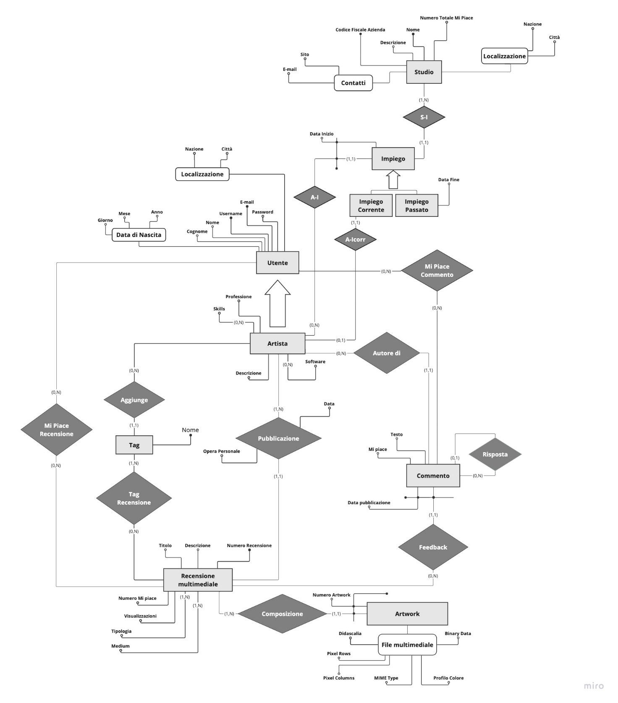

# Artstation Database (University Project)

Welcome to the Artstation Database project! 🎨

In this exciting venture, we set out to create a sleek and efficient database tailored specifically for the Artstation platform. Our journey took us through the entire development process, from ideation to implementation. We meticulously crafted an E-R conceptual database model, translating our ideas into a robust relational model using PostgreSQL.

## Project Highlights

- **Concept to Reality:** We initiated the project by brainstorming and conceptualizing the database structure. This laid the foundation for our journey from theory to practice.

- **E-R Conceptual Database Model:** Take a sneak peek into our thought process with the [Conceptual Scheme](DatabaseER.jpeg). This visual representation showcases the blueprint of our database design.

- **Logical Implementation:** Transitioning from theory to practice, we seamlessly brought our conceptual model to life with a logical implementation. PostgreSQL proved to be our trusty companion throughout this phase.

## Documentation

For an in-depth exploration of our project, dive into our [Documentation](Database-Documentation.pdf) (available in Italian). It covers everything from the initial stages of concept development to the nitty-gritty details of the final implementation.

## Get Started

Ready to explore our project? Follow these steps:

1. Clone the repository.
2. Refer to the documentation for installation instructions and usage guidelines.
3. Dive into the code and database structure to understand the magic behind our Artstation Database.

Feel free to reach out if you have any questions, suggestions, or if you just want to chat about databases and art. Happy exploring! 🚀
